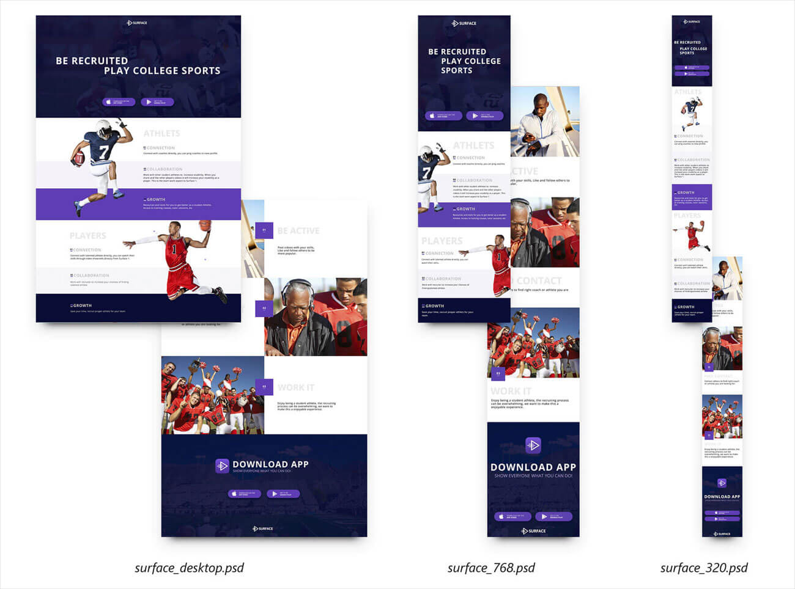

# Surface.
### Дипломный проект по курсу «Адаптивная и мобильная вёрстка» (Нетология).

Ссылка на опубликованный [проект](https://queenarizona.github.io/Surface/).

В рамках дипломного проекта стояла задача сверстать макет сайта для трёх групп устройств: десктопные экраны, планшеты и смартфоны. Макеты сайта для различных экранов должны были выглядеть так:

В процессе вёрстки были реализованы следующие задачи:
* Кроссбраузерная вёрстка
* Адаптивная вёрстка для устройств с различными типами экрана
* Семантическое использование тегов
* Соответствие вёрстки макету (допускались отличия в толщина шрифта, межсимвольном расстоянии, в отступах — до 2px)
* Валидная вёрстка (протестирована с помощью сервиса [W3C Markup Validation Service](https://validator.w3.org))
* Реализация сетки страницы при помощи 'flexbox'
* Соответствие принятому стилю кода для [HTML](https://github.com/netology-code/codestyle/tree/master/html) и [CSS](https://github.com/netology-code/codestyle/tree/master/css)
* Итоговая демонстрации при помощи сервиса [GitHub Pages](https://pages.github.com/)
